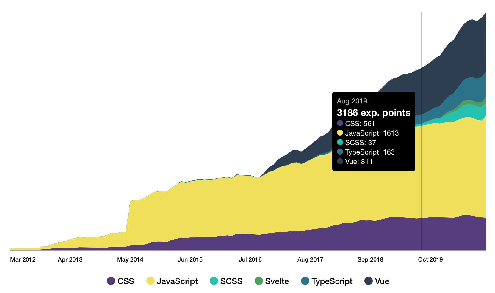

# CodersRank Skills Chart Widget

- [Install from NPM](#install-from-npm)
- [Install from CDN](#install-from-cdn)
- [Usage](#usage)
- [Widget Attributes](#widget-attributes)
- [Styling](#styling)
- [Events](#events)
- [Use As Image](#use-as-image)
- [Contribution](#contribution)
- [Licence](#Licence)

<!-- DOCS_START -->

CodersRank Skills Chart Widget is a web component that allows you easily integrate nice looking skills chart from your [CodersRank](https://codersrank.io) profile to your personal website:



## Install from NPM

Widget script available through NPM:

```
npm i @codersrank/skills-chart --save
```

After installation you need to import and register web component:

```js
import CodersRankSkillsChart from '@codersrank/skills-chart';

// register web component as <codersrank-skills-chart> element
window.customElements.define('codersrank-skills-chart', CodersRankSkillsChart);
```

## Install from CDN

Widget can also be downloaded or linked directly from CDN:

```html
<!-- replace x.x.x with actual version -->
<script src="https://unpkg.com/@codersrank/skills-chart@x.x.x/codersrank-skills-chart.min.js"></script>
```

In this case it is not required to register web component, it is already registered as `<codersrank-skills-chart>` element.

## Usage

As it is a web component the usage is pretty simple, just add widget HTML tag with your [CodersRank](https://codersrank.io) username

```html
<codersrank-skills-chart username="YOUR_USERNAME"></codersrank-skills-chart>
```

## Widget Attributes

Widget supports following properties as HTML element attributes:

| Name                | Type      | Default | Description                                                                                                                                             |
| ------------------- | --------- | ------- | ------------------------------------------------------------------------------------------------------------------------------------------------------- |
| `username`          | `string`  |         | Your [CodersRank](https://codersrank.io) username                                                                                                       |
| `labels`            | `boolean` | `false` | Display chart labels (chart axis with dates)                                                                                                            |
| `legend`            | `boolean` | `false` | Display legend below the chart                                                                                                                          |
| `tooltip`           | `boolean` | `false` | Enables tooltip with number of activities per day                                                                                                       |
| `skills`            | `string`  |         | Allows to specify skills to display in chart. For example `skills="JavaScript, Vue, CSS"`                                                               |
| `active-skills`     | `string`  |         | Allows to specify skills to be active by default (all skills not specified here will appear as disabled). For example `active-skills="JavaScript, Vue"` |
| `svg-width`         | `number`  | `640`   | Render width of chart's SVG element. Ideally should match actual chart width                                                                            |
| `svg-height`        | `number`  | `320`   | Render height of chart's SVG element. Ideally should match actual chart height                                                                          |
| `show-other-skills` | `boolean` | `false` | Group skills not specified in `skills` property under the "Other" chart area                                                                            |
| `max-labels`        | `number`  | `8`     | Maximum amount of labels (dates) to be displayed (dates)                                                                                                |
| `branding`          | `boolean` | `true`  | Displays "Powered by CodersRank" link                                                                                                                   |
| `sort-by-score`     | `boolean` | `false` | Sorts labels by score if true or alphabetically                                                                                                         |

For example, to enable labels, legend and tooltip:

```html
<codersrank-skills-chart
  username="YOUR_USERNAME"
  labels
  legend
  tooltip
></codersrank-skills-chart>
```

## Styling

It is possible to customize widget colors with CSS Custom Properties (CSS Variables) by setting them directly on the widget element with style attribute or in CSS.

There are following CSS Custom Properties are available:

| Property                       | Value                                                     |
| ------------------------------ | --------------------------------------------------------- |
| `--font-family`                | `Open Sans, Helvetica Neue, Helvetica, Arial, sans-serif` |
| `--svg-width`                  | `100%`                                                    |
| `--svg-height`                 | `auto`                                                    |
| `--axis-bg-color`              | `rgba(0, 0, 0, 0.35)`                                     |
| `--hidden-area-color`          | `#ddd`                                                    |
| `--label-text-color`           | `inherit`                                                 |
| `--label-font-size`            | `10px`                                                    |
| `--label-font-weight`          | `500`                                                     |
| `--label-white-space`          | `nowrap`                                                  |
| `--legend-text-color`          | `inherit`                                                 |
| `--legend-disabled-text-color` | `#ccc`                                                    |
| `--legend-font-size`           | `14px`                                                    |
| `--preloader-color`            | `#72a0a8`                                                 |
| `--tooltip-font-size`          | `12px`                                                    |
| `--tooltip-total-font-size`    | `16px`                                                    |
| `--tooltip-total-font-weight`  | `bold`                                                    |
| `--other-skills-area-color`    | `#bbb`                                                    |
| `--chart-bg-color`             | `transparent`                                             |
| `--chart-border-radius`        | `0px`                                                     |
| `--branding-text-color`        | `inherit`                                                 |

For example, to change legend text color to `red` and font-size to `12px`, add this to CSS stylesheet:

```css
codersrank-skills-chart {
  --legend-text-color: red;
  --legend-font-size: 12px;
}
```

## Events

Widget element supports the following events:

<table>
  <thead>
    <tr>
      <th>Name</th>
      <th>Description</th>
      <th>Detail</th>
    </tr>
  </thead>
  <tbody>
    <tr>
      <td><code>error</code></td>
      <td>Will be fired on data request error</td>
      <td>`event.detail` will contain an error object</td>
    </tr>
    <tr>
      <td><code>data</code></td>
      <td>Will be fired right after data request</td>
      <td>
        `event.detail` will contain an object with `highest` and `scores` properties.
        <p>`highest` object contains information about when user had the highest score</p>
        <p>`scores` array contains information about skills scores by dates</p>
      </td>
    </tr>
    <tr>
      <td><code>render</code></td>
      <td>Will be fired right after chart rendered to DOM</td>
      <td></td>
    </tr>
  </tbody>
</table>

For example:

```html
<codersrank-skills-chart id="skills-chart" skils="..."></codersrank-skills-chart>
```

```js
function onData(event) {
  const highest = event.detail.highest;
  console.log(`Highest score was ${highest.score} on ${highest.date}`);
}
document.querySelector('#skills-chart').addEventListener('data', onData);
```

## Use As Image

It is also possible to insert Skills Chart as an image. It is useful in places where you can't integrate web component, or for example on your GitHub profile README.md page.

Image URL is the following:

```
https://cr-skills-chart-widget.azurewebsites.net/api/api?username=YOUR_USERNAME
```

It accepts query parameters:

| Name                | Type      | Default | Description                                                                                       |
| ------------------- | --------- | ------- | ------------------------------------------------------------------------------------------------- |
| `username`          | `string`  |         | Your [CodersRank](https://codersrank.io) username                                                 |
| `skills`            | `string`  |         | Specify skills to display in chart (comma separated), for example `?skills=JavaScript,TypeScript` |
| `width`             | `number`  | `640`   | Render width of chart's SVG element. Ideally should match actual chart width                      |
| `height`            | `number`  | `320`   | Render height of chart's SVG element. Ideally should match actual chart height                    |
| `show-other-skills` | `boolean` | `false` | Group skills not specified in `skills` property under the "Other" chart area                      |
| `bg`                | `string`  | `#fff`  | Chart background image                                                                            |
| `padding`           | `number`  | `0`     | Image content padding                                                                             |

For example:

```html

```

Live example:

```html

```

Note that you need to URL Encode some of the characters, for example `C++` should be `C%2B%2B` and `C#` should be `C%23`

## Contribution

Yes please! See the [contributing guidelines](https://github.com/codersrank-org/skills-chart-widget/blob/master/CONTRIBUTING.md) for details.

## Licence

This project is licensed under the terms of the [MIT license](https://github.com/codersrank-org/skills-chart-widget/blob/master/LICENSE).
